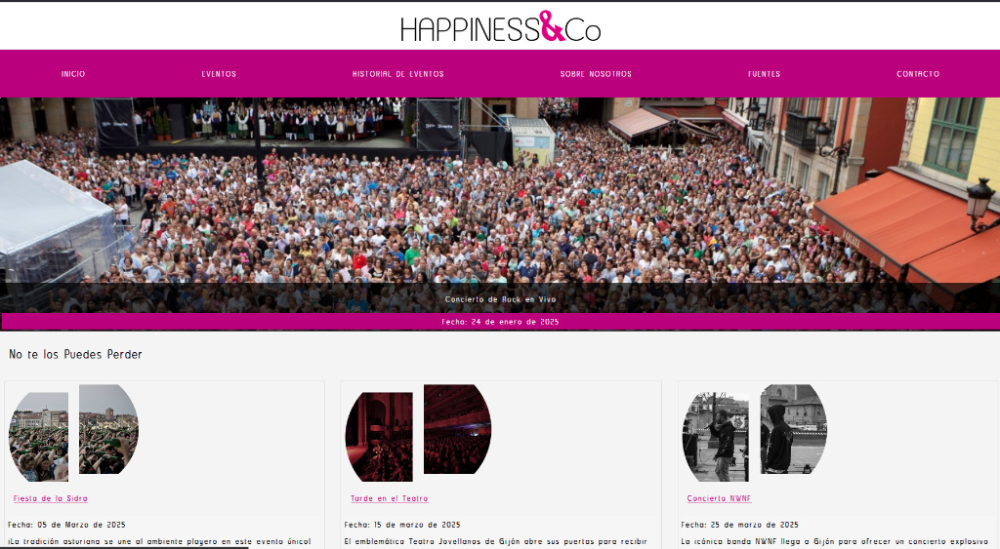

 
# 🎉 Página Happines&CO — Proyecto DAM 1º

Proyecto educativo, desarrollado durante el primer curso del ciclo formativo de Desarrollo de Aplicaciones Multiplataforma (DAM). Se trata de una página web estática para una empresa  llamada Happines&CO, especializada en la organización de eventos culturales y festivos en Asturias. 

El objetivo principal era aplicar los conocimientos  de desarrollo web aprendidos en clase: estructurar contenido con HTML5, darle estilo con CSS y comenzar a entender cómo funciona la navegación entre páginas en un sitio web. Practicando la integración de recursos externos y la organización lógica del proyecto. 

## 🖼️ Capturas de pantalla del proyecto

### Página principal


---

## 📌 Objetivo
Practicar estructura HTML, CSS y navegación entre páginas mediante una web estática con secciones: eventos, historia, equipo y fuentes.

---

## 📁 Estructura del proyecto
```
Pagina-Happines&CO/
├── index.html
├── eventos.html
├── historial.html
├── nosotros.html
├── fuentes.html
├── eventos/
│   ├── eventoFeria.html
│   ├── eventoNWNF.html
│   ├── eventoRock.html
│   ├── eventoSidra.html
│   └── eventoTeatro.html
└── assets/
    ├── css/
    │   └── main.css
    ├── img/
    └── js/
        └── main.js
```

---

## 🛠 Tecnologías
- HTML5 semántico
- CSS3 (responsive)
- JavaScript (mínimo, progresivo)

---

## 🚀 Cómo ver el proyecto (local)
1. [Live demo en GitHub Pages](https://ivanjonasfc.github.io/pagina-web-practica-dam1/index.html) 
2. Clona el repo y abrir la pagina index en local:
   ```bash
   git clone https://github.com/ivanjonasfc/pagina-web-practica-dam1.git
   
   ```

---

---

## 📚 Aprendizaje
- Organización de ficheros.
- Enlaces entre páginas.
- Uso de Css/JavaScript
- Buenas prácticas web estáticas.

---

## ✉️ Contacto
Ivan Jonas — https://github.com/ivanjonasfc

 
